Dưới đây là file README.md chi tiết cho các chủ đề thực tập, được thiết kế theo lộ trình 4 tháng và đáp ứng đầy đủ yêu cầu của bạn:

# HƯỚNG DẪN THỰC TẬP THIẾT KẾ PHẦN CỨNG (07/2025 - 11/2025)

## Mục lục
1. [Tổng quan lộ trình](#-tổng-quan-lộ-trình)
2. [Chuẩn bị kiến thức nền tảng](#-chuẩn-bị-kiến-thức-nền-tảng)
3. [Hướng dẫn chi tiết theo chủ đề](#-hướng-dẫn-chi-tiết-theo-chủ-đề)
   - [1. Thiết kế CPU RISC-V Pipeline](#1-thiết-kế-cpu-risc-v-pipeline)
   - [2. Bộ điều khiển I2C Bus](#2-bộ-điều-khiển-i2c-bus)
   - [3. Bộ xử lý RISC 32-bit](#3-bộ-xử-lý-risc-32-bit)
   - [4. DMA Controller cho AMBA Bus](#4-dma-controller-cho-amba-bus)
   - [5. SDRAM Controller](#5-sdram-controller)
   - [6. Giao thức UART/SPI/I2C](#6-giao-thức-uartspii2c)
4. [Tài nguyên chung](#-tài-nguyên-chung)

---

## 🗓 Tổng quan lộ trình

```mermaid
gantt
    title Lộ trình 4 tháng thực tập
    dateFormat  YYYY-MM-DD
    section Tháng 1 (Nghiên cứu lý thuyết)
    Lý thuyết nền       :active, a1, 2025-07-20, 30d
    
    section Tháng 2-3 (Triển khai FPGA)
    Thiết kế RTL        :a2, after a1, 30d
    Kiểm thử FPGA       :a3, after a2, 30d
    
    section Tháng 4 (Physical Design)
    ASIC Flow           :a4, after a3, 30d
```

---

## 📚 Chuẩn bị kiến thức nền tảng
### Kiến thức bắt buộc:
- **Digital Design**: Boolean algebra, FSM, Timing analysis
- **HDL**: Verilog/VHDL (ưu tiên SystemVerilog)
- **Computer Architecture**: Pipeline, Memory hierarchy
- **Giao thức**: AMBA (AXI/AHB), Wishbone, I2C, SPI, UART

### Công cụ cần cài đặt:
| Tool | Mục đích | Link |
|------|----------|------|
| Vivado | FPGA Implementation | [Xilinx](https://www.xilinx.com) |
| ModelSim | Simulation | [Mentor](https://eda.sw.siemens.com) |
| Icarus Verilog | Open-source Simulation | [iverilog.icarus.com](http://iverilog.icarus.com) |
| GTKWave | Waveform Viewer | [gtkwave.sourceforge.net](http://gtkwave.sourceforge.net) |
| OpenROAD | ASIC Flow | [The-OpenROAD-Project](https://theopenroadproject.org) |

---

## 🧩 Hướng dẫn chi tiết theo chủ đề

### 1. Thiết kế CPU RISC-V Pipeline
#### Kiến thức chuyên sâu:
- RV32I Instruction Set
- Pipeline hazards & forwarding
- Memory-mapped I/O

#### Lộ trình chi tiết:
**Tháng 1: Nghiên cứu lý thuyết**
- Tuần 1: Tìm hiểu RV32I ISA
- Tuần 2: Phân tích pipeline hazards
- Tuần 3: Thiết kế bypass network
- Tuần 4: Branch prediction cơ bản

**Tháng 2-3: Triển khai FPGA**

- Triển khai 5-stage pipeline (IF-ID-EX-MEM-WB)
- Test với CoreMark benchmark
- FPGA: Basys3 Artix-7

**Tháng 4: Physical Design**
- Synthesis với Synopsys Design Compiler
- P&R sử dụng OpenROAD
- Timing closure ở 100MHz

#### Tài liệu tham khảo:
1. [RISC-V Spec](https://riscv.org/technical/specifications/)
2. Patterson & Hennessy: Computer Organization and Design

---

### 2. Bộ điều khiển I2C Bus
#### Kiến thức chuyên sâu:
- I2C Protocol (Version 6.0)
- Clock stretching
- Multi-master arbitration

#### Lộ trình chi tiết:
**Tháng 1: Nghiên cứu lý thuyết**
- Tuần 1: Timing specification (Standard/Fast mode)
- Tuần 2: FSM design cho master/slave
- Tuần 3: Error handling (ACK/NACK)
- Tuần 4: Clock synchronization

**Tháng 2-3: Triển khai FPGA**
- Triển khai Wishbone interface
- Kết nối cảm biến thực (BMP280)
- Test với I2C protocol analyzer

**Tháng 4: Physical Design**
- STA với PrimeTime
- EM analysis
- LVS/DRC clean

#### Sơ đồ FSM:

---

### 3. Bộ xử lý RISC 32-bit
#### Kiến thức chuyên sâu:
- Harvard vs Princeton architecture
- Interrupt handling
- ALU design

#### Lộ trình chi tiết:
**Tháng 1: Nghiên cứu lý thuyết**
- Tuần 1: Thiết kế datapath
- Tuần 2: Control unit design
- Tuần 3: Exception handling
- Tuần 4: Memory interface

**Tháng 2-3: Triển khai FPGA**
- Implement 2-stage pipeline (FETCH-EXEC)
- GPIO interface
- Demo: Run Fibonacci sequence

**Tháng 4: Physical Design**
- Power gating implementation
- Scan chain insertion
- ATPG pattern generation

---

### 4. DMA Controller cho AMBA Bus
#### Kiến thức chuyên sâu:
- AMBA AHB/APB protocols
- Burst transfers
- Arbitration mechanism

#### Lộ trình chi tiết:
**Tháng 1: Nghiên cứu lý thuyết**
- Tuần 1: AHB-Lite spec study
- Tuần 2: Channel priority scheme
- Tuần 3: Descriptor-based transfer
- Tuần 4: Error recovery

**Tháng 2-3: Triển khai FPGA**
- Kết nối với SRAM controller
- Benchmark: Memory copy speed test
- FPGA: Zynq-7000

**Tháng 4: Physical Design**
- Congestion analysis
- Clock tree synthesis
- IR drop analysis

---

### 5. SDRAM Controller
#### Kiến thức chuyên sâu:
- JEDEC SDRAM standard
- Refresh mechanisms
- Bank management

#### Lộ trình chi tiết:
**Tháng 1: Nghiên cứu lý thuyết**
- Tuần 1: Timing parameters (tRCD, tRP, tRAS)
- Tuần 2: Initialization sequence
- Tuần 3: Refresh counter design
- Tuần 4: Burst mode optimization

**Tháng 2-3: Triển khai FPGA**
- Interface với Micron MT48LC16M16
- Hiệu năng: Đạt 80% bus bandwidth
- Sử dụng PLL cho clock domain crossing

**Tháng 4: Physical Design**
- Signal integrity analysis
- Crosstalk minimization
- IO pad ring design

---

### 6. Giao thức UART/SPI/I2C
#### Kiến thức chuyên sâu:
- Baud rate generation
- Frame format
- Error detection

#### Lộ trình chi tiết:
**Tháng 1: Nghiên cứu lý thuyết**
- Tuần 1: UART flow control
- Tuần 2: SPI mode (0-3)
- Tuần 3: I2C advanced features
- Tuần 4: Cross-protocol bridge

**Tháng 2-3: Triển khai FPGA**
- Triển khai configurable IP core
- Test với logic analyzer
- Demo: Sensor data logger

**Tháng 4: Physical Design**
- Multi-corner multi-mode analysis
- Electromigration check
- Tape-out documentation

---

## 🔧 Tài nguyên chung
### Sách tham khảo:
1. "Digital Design and Computer Architecture" - Harris & Harris
2. "FPGA Prototyping by Verilog Examples" - Pong P. Chu
3. "ASIC/SoC Functional Design Verification" - Ashok B. Mehta

### Kho lưu trữ mã nguồn:
- [RISC-V Core](https://github.com/riscv/riscv-cores-list)
- [OpenCores](https://opencores.org)
- [FPGA4Student Projects](https://www.fpga4student.com)

### Quy trình báo cáo:

```mermaid
flowchart TD
    A[Tuần 1: Proposal] --> B[Tuần 4: Design Doc]
    B --> C[Tuần 8: RTL Freeze]
    C --> D[Tuần 12: FPGA Demo]
    D --> E[Tuần 16: Final Report]
```

> **Lưu ý**: Các nhóm cần submit báo cáo tiến độ hàng tuần vào thứ Sáu 17:00. Gặp mentor ít nhất 2 lần/tuần để giải quyết vấn đề kỹ thuật.
